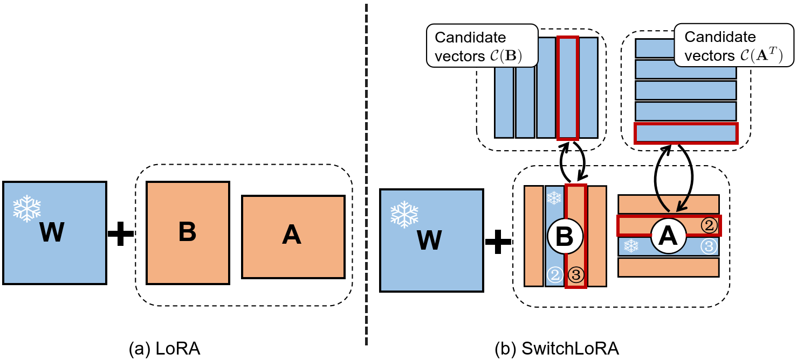

# SwitchLoRA

[TOC]

## Overview

This repository contains code for paper [SwitchLoRA: Switched Low-Rank Adaptation Can Learn Full-Rank Information](https://arxiv.org/abs/2406.06564). SwitchLoRA is a parameter-efficient method aiming at pre-training phase. It dynamically adjusts LoRA parameters during training, achieving performance comparable to full-rank training while drastically reducing memory usage and communication costs.




Loss results for 250M, 350M and 1.3B LLaMA models.


The core switching process of SwitchLoRA:

```python
def switch_lora(model, optimizer, global_step, expect_switch_descend_step):
    lora_layers = lora_utils.iter_lora_layers(model)
    for layer in lora_layers:
        # switch LoRA vectors with candidate vectors
        layer.switch(global_step, expect_switch_descend_step)
        # zero out influenced optimized states 
        layer.zero_lora_states(optimizer)
        # zero out graidents of switched LoRA vectors
        layer.correct_switched_lora()
```


## Quick start

### Enviroment setup

1. Install pytorch following https://pytorch.org/get-started/locally/

2. Clone repository & Install dependencies

   ```shell
   cd path_to_this_repository
   pip install -r requirements.txt
   ```

Our code has been test on `Ubuntu 22.04 LTS`. For details on the installed packages, please refer to `requirements.txt.ubuntu`.

### Download data

```shell
cd llama
# Download data and preprocess it to 512 sequence len
python download_data.py --save_dir preprocessed_data_512 --tokenizer t5-base --dataset allenai/c4 --dataset_config en --take 46000000 --text_field text --sequence_length 512
# Download data and preprocess it to 256 sequence len
python download_data.py --save_dir preprocessed_data_256 --tokenizer t5-base --dataset allenai/c4 --dataset_config en --take 15000000 --text_field text --sequence_length 256
```

### Options

The following are options related to the SwitchLoRA paper, with additional options in the code for testing purposes.

- `model_config`: Path to the model configuration file
- `dataset_path`: Directory containing the training dataset
- `max_length`: Maximum sequence length for input text
- `num_training_steps`: Total number of training iterations
- `batch_size`: Number of samples processed in each device
- `total_batch_size`: Total batch size across all devices/GPUs

- `use_lora`: Whether to use LoRA adapter. If `switch_lora` is specified, `use_lora` will be set to `true` automatically
- `switch_lora`: Whether to use SwitchLoRA
- `lora_rank`: LoRA rank
- `lr`: Learning rate
- `adam_warm_step`: How many steps to freeze LoRA vectors when their counterpart vectors are switched. Set to `5` by default
- `switch_lora_interval`: Initial value of switch interval($interval_0$)
- `switch_lora_descent_rate`: $ratio$ in the SwitchLoRA paper. It determines the point at which the switching frequency is reduced to one-third of its initial value, occurring at the step $total\_step \times ratio$
- `init_lora_type`: Specifies the initialization method. Use `"origin_lora"` for vanilla LoRA initialization or `"switchlora"` for SwitchLoRA initialization.
- `--no_offload_candidates`: Whether to disable offloading of spare candidate vectors to CPU.
- `--discontinuous_switch`: Controls whether candidate vectors are switched as contiguous blocks


### Use SwitchLoRA for pre-training

**Code modifications required for using SwitchLoRA compared to full-rank training:**

- Convert the model layers to LoRA layers using the function `switch_lora.SwitchLoRAModel(...)`.
- Use custom optimizer which supports row-wise/column-wise optimizer state `step`.
- Offload candidate vectors to the CPU using the function `switch_lora.init()`.
- Invoke the switching process at every training step with the function ` switch_lora.switch_lora(...)`.

```python
from switchlora import switch_lora, lora_utils
from switchlora.optimizer import StepAdamW
import torch

parser = argparse.ArgumentParser()
switch_lora.add_parse_switch_lora_args(parser)
args = parser.parse_args(args)
switch_lora.set_hyper_args(args)

# Initialize the model
model = ...
# Apply LoRA to specific layers
model = switch_lora.SwitchLoRAModel(
            model,
            to_lora_layer_name=["attn", "attention", "mlp"],
            r=args.lora_rank,
        )
# model distribution for data parallelism
model = torch.nn.parallel.DistributedDataParallel(...)

switch_lora.init()

# Define optimizer
params = lora_utils.obtain_params_mark_lora(model, args.lr)
optimizer = StepAdamW(params, **optimizer_kwargs)

# Training loop
update_step = 0
for batch in train_loader:
	# Forward pass
    ...
    switch_lora.switch_lora(
        model,
        optimizer,
        update_step,
        args.switch_lora_descent_rate * args.num_training_steps
    )
    optimizer.step()
    update_step += 1
```


## Experiments on LLaMA models

The scripts for LLaMA model experiments are located in the  [./llama/examples/](./llama/examples) directory.

### **Basic experiments**

Examples scripts for the 350M LLaMA model are provided. The scripts can be found in [./llama/examples/basic/](./llama/examples/basic/).

For example, script [./llama/examples/basic/run_full_350m.sh](./llama/examples/basic/run_full_350m.sh), train the 350M LLaMA model with the following command in [./llama](./llama) directory:

```shell
torchrun --nproc-per-node 8 --master_port 14214 main.py --model_config configs/llama_350m.json --dataset_path preprocessed_data/allenai/c4_en_t5-base_512 --batch_size 72 --total_batch_size 1152 --lr 0.02 --max_length 512 --num_training_steps 40000 --save_every 2000 --eval_every 1000 --keep_checkpoints 3 --num_workers 8 --switch_lora --lora_rank 256 --save_dir checkpoints/llama_350m_switchlora_512_batch1152_lr0.02_rate0.1_lora256_step40000 --autoresume True
```

For models with different size, change the parameters in the scripts: `--model_config`,  `--lr`, `--total_batch_size`, `--lora_rank`.

### **Comparison with other methods**

We conduct experiments for [GaLore](https://github.com/jiaweizzhao/GaLore) [1] and [ReLoRA](https://github.com/Guitaricet/relora.git) [2].

- **For GaLore experiments**, clone the repository and install the required packages:

```shell
git clone https://github.com/jiaweizzhao/GaLore.git
cd GaLore
pip install -r exp_requirements.txt
```

Next, use the scripts located in `./llama/examples/galore` to run the experiments. (New data will be downloaded since the data collator used by GaLore differs from ours)

- **For ReLoRA experiments**, clone the repository and set up the environment:

```shell
git clone https://github.com/Guitaricet/relora.git
cd relora
pip install -e .
```

Begin by running full pre-training with the script located at `./llama/examples/relora/run_full_250m.sh`. Following this, use `./llama/examples/relora/run_relora_250m.sh` to train the model using ReLoRA on the checkpoint from the full pre-training at the 1,000th step. Additionally, employ `./llama/examples/relora/run_switchlora_on_full250m.sh` to train the same checkpoint with SwitchLoRA.

### **Reasoning ability comparison**

To run full pre-training with SwitchLoRA, first merge the LoRA adapters into the original model weights:

```shell
cd llama
torchrun --master_port 14202 --nproc-per-node 1 convert_checkpoint.py --model_config configs/llama_350m.json --dataset_path preprocessed_data/allenai/c4_en_t5-base_512 --batch_size 72 --total_batch_size 1152 --max_length 512 --num_training_steps 40000 --num_workers 8 --lora_rank 256 --switch_lora --save_dir checkpoints/llama_350m_switchlora_512_batch1152_lr0.02_rate0.1_lora256_step40000 --autoresume True
```

Then execute the following to run a specific GLUE task:

```shell
# mrpc is GLUE task name. 3e-5 is the learning rate
bash ./llama/examples/glue/run_glue_full_switchlora_256.sh mrpc 3e-5
```

For other experiments, adjust the `--model_name_or_path` parameter to different checkpoints as shown in `./llama/examples/glue/run_glue_full_full.sh`.


## TODO

- [ ] GPT-2 training script.
- [ ] Convolution model support.
- [ ] Quantization.

## References

[1] Vladislav Lialin, Sherin Muckatira, Namrata Shivagunde, and Anna Rumshisky. ReloRA: High

rank training through low-rank updates. In *Workshop on Advancing Neural Network Training:*

*Computational Efficiency, Scalability, and Resource Optimization (WANT@NeurIPS 2023)*, 2023.

[2] Jiawei Zhao, Zhenyu Zhang, Beidi Chen, Zhangyang Wang, Anima Anandkumar, and Yuandong Tian.

Galore: Memory-efficient LLM training by gradient low-rank projection. *CoRR*, abs/2403.03507,

2024b. doi: 10.48550/ARXIV.2403.03507.
